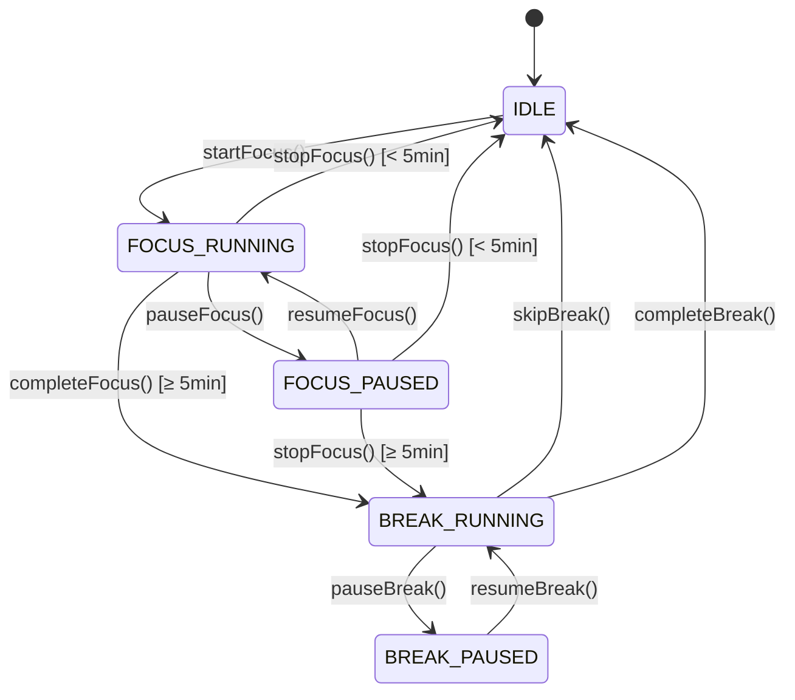

# FlowDashboard 開發規格 (Development Spec) v1.0

> 本文件為開發者技術規格，基於 PRD v1.1 與 UX/UI Spec v1.0 產出。

---

## 1. 專案概述

| 項目 | 規格 |
|------|------|
| 專案名稱 | 心流儀表板 (FlowDashboard) |
| 類型 | 靜態網頁應用 (Static Web App) |
| 技術棧 | HTML5 + CSS3 + Vanilla JavaScript |
| 支援環境 | 桌面瀏覽器 (Chrome, Firefox, Edge, Safari) |
| 最低解析度 | 1024px 寬度 |
| 資料儲存 | localStorage |

---

## 2. 檔案結構

```
FlowDashboard/
├── index.html                 # 主頁面
├── styles/
│   ├── variables.css          # CSS 變數 (顏色、字型、間距)
│   ├── base.css               # 基礎樣式 (reset, typography)
│   ├── layout.css             # 版面佈局
│   ├── components/
│   │   ├── timer.css          # 番茄鐘元件
│   │   ├── top3.css           # 三大優先元件
│   │   ├── task-card.css      # 任務卡片元件
│   │   ├── summary-fab.css    # 今日摘要浮動按鈕
│   │   └── record-panel.css   # 紀錄表元件
│   └── index.css              # 樣式入口 (imports)
├── scripts/
│   ├── app.js                 # 應用程式入口
│   ├── state/
│   │   ├── store.js           # 狀態管理
│   │   └── actions.js         # 狀態操作
│   ├── modules/
│   │   ├── timer.js           # 番茄鐘邏輯
│   │   ├── tasks.js           # 任務管理
│   │   ├── top3.js            # 三大優先邏輯
│   │   └── summary.js         # 摘要邏輯
│   ├── services/
│   │   ├── storage.js         # localStorage 封裝
│   │   ├── notification.js    # 通知系統
│   │   └── audio.js           # 音效系統
│   └── utils/
│       ├── time.js            # 時間格式化
│       └── dom.js             # DOM 操作工具
└── assets/
    ├── audio/
    │   ├── focus-end.mp3      # 專注結束音效
    │   ├── break-end.mp3      # 緩衝結束音效
    │   └── task-complete.mp3  # 任務完成音效
    └── icons/
        └── favicon.svg        # 網站圖示
```

---

## 3. 狀態機規格 (Timer State Machine)

### 3.1 狀態定義

```javascript
const TimerState = {
  IDLE: 'IDLE',
  FOCUS_RUNNING: 'FOCUS_RUNNING',
  FOCUS_PAUSED: 'FOCUS_PAUSED',
  BREAK_RUNNING: 'BREAK_RUNNING',
  BREAK_PAUSED: 'BREAK_PAUSED'
};
```

### 3.2 狀態轉換圖



### 3.3 狀態轉換 Actions

```javascript
// Timer Actions Interface
interface TimerActions {
  startFocus(): void;      // IDLE → FOCUS_RUNNING
  pauseFocus(): void;      // FOCUS_RUNNING → FOCUS_PAUSED
  resumeFocus(): void;     // FOCUS_PAUSED → FOCUS_RUNNING
  stopFocus(): void;       // FOCUS_* → IDLE or BREAK_RUNNING
  skipBreak(): void;       // BREAK_RUNNING → IDLE
  pauseBreak(): void;      // BREAK_RUNNING → BREAK_PAUSED
  resumeBreak(): void;     // BREAK_PAUSED → BREAK_RUNNING
  completeBreak(): void;   // BREAK_RUNNING → IDLE (auto)
  completeFocus(): void;   // FOCUS_RUNNING → BREAK_RUNNING (auto)
}
```

---

## 4. 資料模型 (Data Models)

### 4.1 應用程式狀態

```typescript
interface AppState {
  // 日期戳記（用於判斷是否清空）
  date: string; // 'YYYY-MM-DD'
  
  // 番茄鐘
  timer: TimerState;
  
  // 三大優先
  top3: Top3State;
  
  // 任務列表
  tasks: Task[];
  
  // 專注紀錄
  focusRecords: FocusRecord[];
  
  // 設定
  settings: Settings;
}
```

### 4.2 Timer 狀態

```typescript
interface TimerState {
  status: 'IDLE' | 'FOCUS_RUNNING' | 'FOCUS_PAUSED' | 'BREAK_RUNNING' | 'BREAK_PAUSED';
  focusDuration: number;        // 設定的專注時長（分鐘）5-60
  breakDuration: number;        // 緩衝時長（分鐘）5 or 15
  remainingSeconds: number;     // 剩餘秒數
  elapsedSeconds: number;       // 已經過秒數（用於判斷有效專注）
  currentTaskId: string | null; // 當前進行的任務 ID
  focusCount: number;           // 今日專注次數（用於判斷長休息）
  startTime: number | null;     // 開始時間戳（用於暫存紀錄）
}
```

### 4.3 三大優先

```typescript
interface Top3State {
  items: [Top3Item, Top3Item, Top3Item];
}

interface Top3Item {
  text: string;
  completed: boolean;
}
```

### 4.4 任務

```typescript
interface Task {
  id: string;              // UUID
  name: string;            // 任務名稱（必填）
  description: string;     // 一句話了解（必填）
  steps: TaskStep[];       // 步驟列表（1-3 個）
  completed: boolean;      // 任務完成狀態
  createdAt: number;       // 建立時間戳
  completedAt: number | null;
}

interface TaskStep {
  id: string;
  text: string;
  completed: boolean;
}
```

### 4.5 專注紀錄

```typescript
interface FocusRecord {
  id: string;              // UUID
  index: number;           // 第幾次專注（從 1 開始）
  duration: number;        // 專注時長（分鐘）- 可編輯
  taskName: string;        // 關聯任務名稱 - 可編輯
  startTime: number;       // 開始時間戳
  endTime: number;         // 結束時間戳
}
```

### 4.6 設定

```typescript
interface Settings {
  soundEnabled: boolean;   // 音效開關
  soundVolume: number;     // 音量 0-1
  notificationEnabled: boolean; // 通知開關（由瀏覽器授權決定）
}
```

---

## 5. localStorage 規格

### 5.1 儲存 Key

```javascript
const STORAGE_KEY = 'flowdashboard_state';
```

### 5.2 儲存格式

```javascript
localStorage.setItem(STORAGE_KEY, JSON.stringify({
  version: 1,              // 資料格式版本
  date: '2026-01-21',      // 當日日期
  data: AppState           // 完整狀態
}));
```

### 5.3 日期檢查邏輯

```javascript
function checkAndResetIfNewDay() {
  const stored = JSON.parse(localStorage.getItem(STORAGE_KEY));
  const today = new Date().toISOString().split('T')[0];
  
  if (!stored || stored.date !== today) {
    // 清空所有資料，初始化新的一天
    return createInitialState();
  }
  
  return stored.data;
}
```

---

## 6. 元件規格

### 6.1 Timer 元件

#### DOM 結構
```html
<section id="timer-section" class="timer">
  <div class="timer__status-badge" data-status="idle">準備開始</div>
  
  <div class="timer__display">
    <span class="timer__time">25:00</span>
  </div>
  
  <div class="timer__duration-control" data-visible="idle">
    <button class="timer__duration-btn" data-action="decrease">−</button>
    <span class="timer__duration-value">25 分鐘</span>
    <button class="timer__duration-btn" data-action="increase">+</button>
  </div>
  
  <div class="timer__actions">
    <button id="timer-primary-btn" class="btn btn--primary">開始專注</button>
    <button id="timer-secondary-btn" class="btn btn--secondary" hidden>停止</button>
  </div>
  
  <button id="record-toggle" class="timer__record-toggle">
    ▼ 展開紀錄
  </button>
  
  <div id="record-panel" class="record-panel" hidden>
    <!-- 紀錄表內容 -->
  </div>
</section>
```

#### 按鈕狀態對照表

| 狀態 | Primary Button | Secondary Button |
|------|----------------|------------------|
| IDLE | `開始專注` | hidden |
| FOCUS_RUNNING | `暫停` | `停止` |
| FOCUS_PAUSED | `繼續` | `停止` |
| BREAK_RUNNING | `跳過緩衝` | hidden |
| BREAK_PAUSED | `繼續` | hidden |

---

### 6.2 Top3 元件

#### DOM 結構
```html
<section id="top3-section" class="top3">
  <h2 class="top3__title">今日三大優先</h2>
  <ul class="top3__list">
    <li class="top3__item">
      <input type="checkbox" id="top3-1-check" class="top3__checkbox">
      <input type="text" id="top3-1-text" class="top3__input" placeholder="優先事項 1...">
    </li>
    <li class="top3__item">
      <input type="checkbox" id="top3-2-check" class="top3__checkbox">
      <input type="text" id="top3-2-text" class="top3__input" placeholder="優先事項 2...">
    </li>
    <li class="top3__item">
      <input type="checkbox" id="top3-3-check" class="top3__checkbox">
      <input type="text" id="top3-3-text" class="top3__input" placeholder="優先事項 3...">
    </li>
  </ul>
</section>
```

---

### 6.3 Task Card 元件

#### DOM 結構（單一卡片）
```html
<article class="task-card" data-task-id="uuid" data-status="default">
  <header class="task-card__header">
    <input type="checkbox" class="task-card__checkbox">
    <input type="text" class="task-card__name" value="任務名稱" placeholder="任務名稱...">
    <button class="task-card__delete" aria-label="刪除任務">🗑</button>
  </header>
  
  <div class="task-card__body">
    <input type="text" class="task-card__description" placeholder="一句話說明這個任務...">
    
    <ul class="task-card__steps">
      <li class="task-card__step">
        <input type="checkbox" class="task-card__step-check">
        <input type="text" class="task-card__step-text" placeholder="步驟 1（必填）">
      </li>
      <li class="task-card__step">
        <input type="checkbox" class="task-card__step-check">
        <input type="text" class="task-card__step-text" placeholder="步驟 2（選填）">
      </li>
      <li class="task-card__step">
        <input type="checkbox" class="task-card__step-check">
        <input type="text" class="task-card__step-text" placeholder="步驟 3（選填）">
      </li>
    </ul>
  </div>
</article>
```

#### 狀態 CSS Classes

| 狀態 | Class | 視覺效果 |
|------|-------|----------|
| 預設 | `.task-card` | 正常 |
| 當前進行中 | `.task-card--active` | 左側藍色邊線 + 背景微亮 |
| 已完成 | `.task-card--completed` | opacity: 0.5 |

---

### 6.4 Summary FAB 元件

#### DOM 結構
```html
<div id="summary-fab" class="summary-fab">
  <button class="summary-fab__trigger" aria-label="今日摘要">
    📊
  </button>
  
  <div class="summary-fab__panel" hidden>
    <div class="summary-fab__item">
      <span class="summary-fab__label">專注次數</span>
      <span class="summary-fab__value" id="summary-focus-count">0</span>
    </div>
    <div class="summary-fab__item">
      <span class="summary-fab__label">總時間</span>
      <span class="summary-fab__value" id="summary-total-time">0m</span>
    </div>
    <div class="summary-fab__item">
      <span class="summary-fab__label">完成任務</span>
      <span class="summary-fab__value" id="summary-task-count">0</span>
    </div>
  </div>
</div>
```

---

## 7. 服務規格

### 7.1 Storage Service

```javascript
// services/storage.js
export const StorageService = {
  STORAGE_KEY: 'flowdashboard_state',
  
  load(): AppState | null,
  save(state: AppState): void,
  clear(): void,
  checkDateAndReset(): AppState
};
```

### 7.2 Notification Service

```javascript
// services/notification.js
export const NotificationService = {
  // 請求通知權限
  requestPermission(): Promise<boolean>,
  
  // 檢查權限狀態
  hasPermission(): boolean,
  
  // 發送通知
  notify(title: string, body: string): void,
  
  // 標題閃爍 fallback
  startTitleFlash(message: string): void,
  stopTitleFlash(): void
};
```

### 7.3 Audio Service

```javascript
// services/audio.js
export const AudioService = {
  // 初始化音效
  init(): void,
  
  // 播放音效
  playFocusEnd(): void,
  playBreakEnd(): void,
  playTaskComplete(): void,
  
  // 音量控制
  setVolume(volume: number): void,  // 0-1
  
  // 開關
  setEnabled(enabled: boolean): void,
  isEnabled(): boolean
};
```

---

## 8. 事件處理規格

### 8.1 Timer 事件

| 事件 | 處理 |
|------|------|
| 點擊「開始專注」 | `startFocus()` → 啟動計時、建立暫存紀錄 |
| 點擊「暫停」 | `pauseFocus()` → 暫停計時 |
| 點擊「繼續」 | `resumeFocus()` → 繼續計時 |
| 點擊「停止」 | `stopFocus()` → 判斷有效專注 → 記錄或放棄 |
| 時間歸零（專注）| `completeFocus()` → 記錄 → 播放音效 → 通知 → 進入緩衝 |
| 點擊「跳過緩衝」| `skipBreak()` → 直接回 IDLE |
| 時間歸零（緩衝）| `completeBreak()` → 播放音效 → 通知 → 回 IDLE |

### 8.2 任務事件

| 事件 | 處理 |
|------|------|
| 點擊「+」| 新增空白任務卡片 → focus 到名稱輸入框 |
| 輸入變更 | debounce 儲存至 localStorage |
| 點擊刪除 | 移除任務（無確認） |
| 勾選任務 | 標記完成 → 淡化 → 移至列表底部 → 播放音效 |
| 勾選步驟 | 標記步驟完成 → 加刪除線 |
| 專注中點擊卡片 | 設為當前任務 / 取消選取 |

### 8.3 Top3 事件

| 事件 | 處理 |
|------|------|
| 輸入變更 | 即時儲存 |
| 勾選 | 加刪除線、儲存 |

---

## 9. 關鍵計算邏輯

### 9.1 長休息判斷

```javascript
function getBreakDuration(focusCount) {
  // 每第 3 次專注後進入 15 分鐘長休息
  return (focusCount % 3 === 0) ? 15 : 5;
}
```

### 9.2 有效專注判斷

```javascript
function isValidFocus(elapsedSeconds) {
  return elapsedSeconds >= 5 * 60; // ≥ 5 分鐘
}
```

### 9.3 時間格式化

```javascript
function formatTime(seconds) {
  const mins = Math.floor(seconds / 60);
  const secs = seconds % 60;
  return `${String(mins).padStart(2, '0')}:${String(secs).padStart(2, '0')}`;
}

function formatDuration(minutes) {
  if (minutes >= 60) {
    const hours = Math.floor(minutes / 60);
    const mins = minutes % 60;
    return mins > 0 ? `${hours}h ${mins}m` : `${hours}h`;
  }
  return `${minutes}m`;
}
```

---

## 10. CSS 設計規範

### 10.1 CSS 變數 (variables.css)

```css
:root {
  /* Colors */
  --color-primary: #3B82F6;
  --color-primary-light: #60A5FA;
  --color-primary-dark: #2563EB;
  --color-secondary: #10B981;
  --color-secondary-light: #34D399;
  --color-bg: #0F172A;
  --color-surface: #1E293B;
  --color-border: #334155;
  --color-text-primary: #F8FAFC;
  --color-text-secondary: #94A3B8;
  --color-warning: #F59E0B;
  --color-error: #EF4444;
  --color-success: #22C55E;

  /* Typography */
  --font-family: 'Inter', 'Noto Sans TC', system-ui, sans-serif;
  --text-xs: 0.75rem;
  --text-sm: 0.875rem;
  --text-base: 1rem;
  --text-lg: 1.125rem;
  --text-xl: 1.25rem;
  --text-2xl: 1.5rem;
  --text-timer: 4.5rem;

  /* Spacing */
  --space-1: 0.25rem;
  --space-2: 0.5rem;
  --space-3: 0.75rem;
  --space-4: 1rem;
  --space-6: 1.5rem;
  --space-8: 2rem;

  /* Border Radius */
  --radius-sm: 4px;
  --radius-md: 8px;
  --radius-lg: 12px;
  --radius-full: 9999px;

  /* Shadows */
  --shadow-sm: 0 1px 2px rgba(0, 0, 0, 0.3);
  --shadow-md: 0 4px 6px rgba(0, 0, 0, 0.3);

  /* Transitions */
  --transition-fast: 200ms ease-out;
}
```

### 10.2 Layout (layout.css)

```css
/* 主版面配置 */
.app {
  display: grid;
  grid-template-rows: 48px 1fr;
  height: 100vh;
  background: var(--color-bg);
}

.app__header {
  display: flex;
  align-items: center;
  padding: 0 var(--space-6);
  background: var(--color-surface);
  border-bottom: 1px solid var(--color-border);
}

.app__main {
  display: grid;
  grid-template-columns: 1fr 1fr;
}

.app__left {
  display: flex;
  align-items: center;
  justify-content: center;
  padding: var(--space-8);
}

.app__right {
  display: grid;
  grid-template-rows: 30% 70%;
  border-left: 1px solid var(--color-border);
  overflow: hidden;
}
```

---

## 11. 瀏覽器相容性

### 11.1 目標瀏覽器

- Chrome 90+
- Firefox 88+
- Edge 90+
- Safari 14+

### 11.2 必備 API

- `localStorage`
- `Notification API`
- `Audio API`
- `CSS Grid`
- `CSS Custom Properties`

---

## 12. 驗收標準 (Acceptance Criteria)

### 12.1 核心功能

- [ ] 番茄鐘狀態機完整運作（5 種狀態切換正確）
- [ ] 有效專注判斷正確（≥ 5 分鐘才記錄）
- [ ] 長休息自動判斷（每 3 次專注後 15 分鐘）
- [ ] 專注時間可調整（5-60 分鐘）

### 12.2 任務管理

- [ ] 可新增任務（點擊 + 按鈕）
- [ ] 可刪除任務
- [ ] 步驟可個別勾選
- [ ] 完成任務移至底部

### 12.3 資料儲存

- [ ] localStorage 正確儲存
- [ ] 跨日自動清空資料
- [ ] 紀錄表時間與任務名稱可編輯

### 12.4 通知系統

- [ ] 首次使用請求授權
- [ ] 專注/緩衝結束時發送通知
- [ ] 拒絕授權時標題閃爍

### 12.5 音效系統

- [ ] 專注/緩衝結束播放音效
- [ ] 音效可開關
- [ ] 音量可調整

### 12.6 UX 要求

- [ ] 動畫 ≤ 200ms
- [ ] 無 modal / toast
- [ ] 同時僅一個主要 CTA

---

## 13. 開發順序建議

### Phase 1：基礎架構
1. 建立檔案結構
2. 實作 CSS 變數與基礎樣式
3. 實作 localStorage Service
4. 實作狀態管理基礎

### Phase 2：核心元件
1. Timer 元件（狀態機完整）
2. Timer 計時邏輯
3. 專注紀錄表

### Phase 3：任務系統
1. Task Card 元件
2. Top3 元件
3. 任務與專注關聯

### Phase 4：輔助功能
1. Summary FAB
2. Notification Service
3. Audio Service

### Phase 5：整合測試
1. 跨日清空測試
2. 完整流程測試
3. 邊界條件測試
