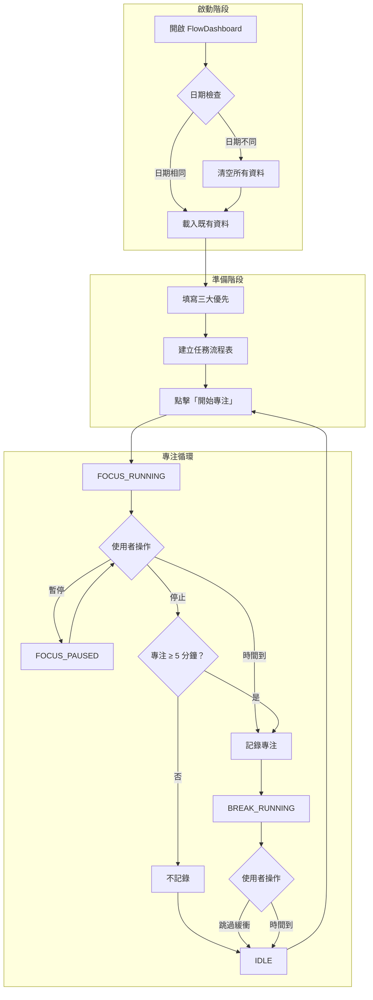

# FlowDashboard UX/UI 規格 v2.0

> 本文件基於 PRD v1.1，定義 FlowDashboard 的使用者流程、互動規範與視覺設計指南。
> **v2.0 更新**：採用 Wabi-Sabi（侘寂）美學風格。

---

## 0. 設計哲學：Wabi-Sabi（侘寂）

### 0.1 什麼是 Wabi-Sabi？

Wabi-Sabi 是日本美學的核心概念，源自茶道與禪宗，強調：

| 概念 | 意涵 | 在 FlowDashboard 的應用 |
|------|------|-------------------------|
| **Wabi（侘）** | 簡樸、謙遜、與自然和諧 | 極簡介面、無多餘裝飾 |
| **Sabi（寂）** | 時間流逝的美感、寧靜 | 柔和的大地色調、沉穩氛圍 |
| **不完美之美** | 接受不對稱與自然瑕疵 | 有機圓角、手工質感 |
| **留白（間）** | 空間即是內容的一部分 | 大量呼吸空間、不擁擠 |
| **自然材質** | 木、石、紙、陶的質感 | 和紙紋理、陶土色調 |

### 0.2 為何選擇 Wabi-Sabi？

FlowDashboard 的核心哲學是「讓專注本身變安靜」，這與 Wabi-Sabi 完美契合：

- **不評價使用者** → 如同茶道不評價茶具的完美程度
- **不製造焦慮** → 大地色調帶來平靜而非警示
- **陪伴而非催促** → 緩慢的動畫如同呼吸節奏
- **今日即是全部** → 如同一期一會的當下意識

### 0.3 設計原則

```
┌─────────────────────────────────────────────────────────────┐
│                    Wabi-Sabi 設計原則                        │
├─────────────────────────────────────────────────────────────┤
│                                                              │
│   1. 簡樸優於華麗（Simple over Ornate）                      │
│      → 移除所有非必要的視覺元素                              │
│                                                              │
│   2. 自然優於人工（Organic over Artificial）                 │
│      → 大地色調、有機形狀、柔和光線                          │
│                                                              │
│   3. 寧靜優於刺激（Calm over Stimulating）                   │
│      → 低對比、慢動畫、無閃爍                                │
│                                                              │
│   4. 空間優於填滿（Space over Filling）                      │
│      → 足夠的留白讓視覺呼吸                                  │
│                                                              │
│   5. 質感優於平面（Texture over Flat）                       │
│      → 微妙的紋理增添溫度                                    │
│                                                              │
└─────────────────────────────────────────────────────────────┘
```

---

## 1. User Flow（使用者流程）

### 1.1 主要流程圖



---

### 1.2 細部流程說明

#### Flow A：首次進入
1. 使用者開啟網頁
2. 系統檢查 localStorage 日期戳記
3. 若日期不同 → 清空資料 → 顯示空白狀態
4. 若日期相同 → 載入既有資料

#### Flow B：建立任務
1. 點擊「新增任務」
2. 輸入任務名稱（必填）
3. 輸入一句話了解（必填）
4. 輸入步驟 1（必填）
5. 可選填步驟 2、3
6. 任務卡片出現於列表

#### Flow C：專注循環
1. 點擊「開始專注」→ 計時開始
2. 可選：點擊任務指定當前任務
3. 可操作：暫停 / 繼續 / 停止
4. 時間到或手動停止 → 判斷有效專注
5. 有效 → 記錄 → 進入緩衝
6. 緩衝結束或跳過 → 回到待命

---

## 2. 頁面 Layout 規格

### 2.1 整體結構

```
┌──────────────────────────────────────────────────────────────────┐
│                       心流儀表板 (Header)                         │
├─────────────────────────────┬────────────────────────────────────┤
│                             │         Top 3 Priorities           │
│                             │         (右上，約 30% 高度)         │
│      Timer Section          ├────────────────────────────────────┤
│      (左側 50%)             │         Task List                  │
│                             │         (右下，約 70% 高度)         │
│                             │                                    │
├─────────────────────────────┴────────────────────────────────────┤
│ [📊]                                                              │
└──────────────────────────────────────────────────────────────────┘
  ↑
  左下浮動按鈕（今日摘要）
```

### 2.2 區塊尺寸定義

| 區塊 | 寬度 | 高度 | 備註 |
|------|------|------|------|
| Header | 100% | 48px | 標題「心流儀表板」 |
| 整體容器 | 100vw | calc(100vh - 48px) | 全螢幕佈局 |
| Timer Section | 50% | 100% | 主視覺區 |
| Right Panel | 50% | 100% | 右側功能區 |
| Top 3 | 100% (右側) | 30% | 方向提醒 |
| Task List | 100% (右側) | 70% | 可捲動 |
| 摘要浮動按鈕 | 56px | 56px | 固定左下角 |

### 2.3 響應式斷點

| 斷點 | 行為 |
|------|------|
| ≥ 1024px | 雙欄佈局（50/50） |
| < 1024px | **不支援**（顯示提示訊息） |

---

## 3. 元件規格（Component Specs）

### 3.1 Timer 番茄鐘

#### 結構
```
┌─────────────────────────────┐
│                             │
│         [狀態標籤]          │
│                             │
│         25 : 00             │  ← 主計時器（大字）
│                             │
│     [ 主要操作按鈕 ]         │
│     [ 次要操作按鈕 ]         │
│                             │
│   [▼ 展開紀錄表]            │
│                             │
└─────────────────────────────┘
```

#### 狀態標籤文案（Wabi-Sabi 風格）

> 文案採用禪意表達，不催促、不評價，如同茶室中的靜謐時刻。

| 狀態 | 標籤文案 | 顏色變數 | 視覺意象 |
|------|----------|----------|----------|
| IDLE | 靜待 | text-muted | 如茶室等待客人 |
| FOCUS_RUNNING | 沉浸 | primary | 如入定冥想 |
| FOCUS_PAUSED | 小憩 | accent | 如暫放茶杯 |
| BREAK_RUNNING | 呼吸 | secondary | 如庭園漫步 |
| BREAK_PAUSED | 駐足 | accent | 如觀賞枯山水 |

#### 按鈕配置（Wabi-Sabi 風格）

> 按鈕文案簡潔有力，不使用驚嘆號或強調語氣。

| 狀態 | 主要按鈕 | 次要按鈕 | 主按鈕樣式 |
|------|----------|----------|------------|
| IDLE | 開始 | — | 實心 primary |
| FOCUS_RUNNING | 暫歇 | 結束 | 實心 primary |
| FOCUS_PAUSED | 續行 | 結束 | 邊框 primary |
| BREAK_RUNNING | 回歸 | — | 邊框 secondary |
| BREAK_PAUSED | 續行 | — | 邊框 secondary |

#### 按鈕樣式（Wabi-Sabi）

```css
/* 主要按鈕（如陶器的溫潤觸感） */
.btn--primary {
  background: var(--color-primary);
  color: var(--color-text-primary);
  border: none;
  border-radius: var(--radius-sm);
  padding: var(--space-3) var(--space-6);
  font-family: var(--font-body);
  font-weight: var(--font-medium);
  letter-spacing: var(--tracking-wide);
  transition: all 250ms var(--ease-out-soft);
  cursor: pointer;
}

.btn--primary:hover {
  background: var(--color-primary-light);
  box-shadow: var(--shadow-sm);
}

/* 次要按鈕（如竹器的纖細） */
.btn--secondary {
  background: transparent;
  color: var(--color-text-secondary);
  border: var(--border-subtle);
  border-radius: var(--radius-sm);
  padding: var(--space-2) var(--space-4);
  transition: all 250ms var(--ease-out-soft);
  cursor: pointer;
}

.btn--secondary:hover {
  color: var(--color-text-primary);
  border-color: var(--color-border);
}
```

#### 時間設定（IDLE 時可調整）
- Slider 或 +/- 按鈕
- 範圍：5–60 分鐘
- 步進：5 分鐘

---

### 3.2 Top 3 Priorities 三大優先

#### 結構
```
┌─────────────────────────────┐
│  今日三大優先                │
├─────────────────────────────┤
│  [☐] ____________________   │
│  [☐] ____________________   │
│  [☐] ____________________   │
└─────────────────────────────┘
```

#### 互動
- 點擊 checkbox → 勾選 / 取消勾選
- 勾選後文字加上 `text-decoration: line-through`
- 輸入框可留空
- 即時儲存至 localStorage

---

### 3.3 Task Card 任務卡片

#### 新增任務
- 點擊「**+**」按鈕 → 新增空白任務卡片
- 空白卡片自動 focus 到任務名稱輸入框

#### 結構
```
┌─────────────────────────────────────┐
│ [☐] 任務名稱                    [🗑] │
├─────────────────────────────────────┤
│ 一句話了解：___________________      │
├─────────────────────────────────────┤
│ [☐] 步驟 1：_____________________   │
│ [☐] 步驟 2：_____________________   │
│ [☐] 步驟 3：_____________________   │
└─────────────────────────────────────┘
```

#### 步驟 Checkbox
- 每個步驟可**個別勾選**
- 勾選後該步驟文字加上刪除線
- 所有步驟完成 ≠ 任務完成（需手動勾選任務 checkbox）

#### 狀態變化（Wabi-Sabi 風格）

| 狀態 | 視覺表現 | 設計意象 |
|------|----------|----------|
| 預設 | surface 背景 + subtle 邊框 | 如未點燃的蠟燭 |
| 當前進行中 | 左側 3px 焦茶邊線 + 微暖光暈 | 如燃起的燭光 |
| 已完成 | opacity: 0.4 + 移動至底部 | 如落葉歸根 |
| Hover | shadow-sm + 微亮背景 | 如手指輕觸 |

```css
/* 任務卡片（如和紙信箋） */
.task-card {
  background: var(--color-surface);
  border: var(--border-subtle);
  border-radius: var(--radius-md);
  padding: var(--space-card-padding);
  transition: all 300ms var(--ease-natural);
  cursor: pointer;
}

.task-card:hover {
  background: var(--color-surface-elevated);
  box-shadow: var(--shadow-sm);
}

/* 當前進行中（如點燃的香） */
.task-card--active {
  border-left: 3px solid var(--color-primary);
  background: linear-gradient(
    90deg,
    rgba(139, 115, 85, 0.08) 0%,
    var(--color-surface) 30%
  );
  box-shadow: var(--shadow-sm);
}

/* 已完成（如落葉） */
.task-card--completed {
  opacity: 0.4;
  transform: translateY(4px);
}
```

#### 互動規則
- 專注中：點擊卡片 → 設為「當前任務」
- 再次點擊 → 取消選取
- 點擊刪除圖示 → 刪除任務（無確認）
- 勾選主 checkbox → 任務完成

---

### 3.4 Summary FAB 今日摘要浮動按鈕

#### 結構
```
收合狀態：          展開狀態：
┌────┐            ┌─────────────────┐
│ 📊 │     →      │ 專注次數：3      │
└────┘            │ 總時間：1h 15m   │
                  │ 完成任務：2      │
                  └─────────────────┘
```

#### 互動
- 點擊按鈕 → 展開 / 收合 toggle
- 展開方向：向上展開
- 點擊外部 → 自動收合

---

### 3.5 Focus Record Panel 專注紀錄表

#### 結構（展開時）
```
┌─────────────────────────────────────┐
│ ▲ 收合紀錄                          │
├─────┬──────────┬────────────────────┤
│ #1  │ [25 分鐘]│ [編輯中的任務名稱]  │
│ #2  │ [30 分鐘]│ [任務名稱]          │
│ ... │ ...      │ ...                │
└─────┴──────────┴────────────────────┘
```

#### 規則
- 預設收合，點擊展開
- 最新紀錄在上
- **任務名稱可編輯**（inline edit）
- **專注時間可編輯**（點擊時間數字可修改）

---

## 4. 互動狀態定義

### 4.1 按鈕狀態

| 狀態 | 視覺變化 |
|------|----------|
| Default | 基礎樣式 |
| Hover | brightness: 1.1 |
| Active | scale: 0.98 |
| Disabled | opacity: 0.5, cursor: not-allowed |
| Focus | outline: 2px solid primary |

### 4.2 輸入框狀態

| 狀態 | 視覺變化 |
|------|----------|
| Default | border: 1px solid border-color |
| Focus | border-color: primary |
| Error | border-color: error |
| Filled | 文字顯示 |

### 4.3 動畫規範（Wabi-Sabi 風格）

> **設計哲學**：動畫如同呼吸，緩慢而有機。避免突兀的變化，
> 讓每個過渡都如同水墨在宣紙上的暈染，自然而不可預測。

#### 時間曲線

```css
:root {
  /* === 緩動函數（Easing） === */

  /* 自然呼吸：緩起緩落，如呼吸節奏 */
  --ease-natural: cubic-bezier(0.25, 0.1, 0.25, 1);

  /* 柔和進入：如燭光漸亮 */
  --ease-in-soft: cubic-bezier(0.4, 0, 0.2, 1);

  /* 柔和離開：如墨跡暈開 */
  --ease-out-soft: cubic-bezier(0, 0, 0.2, 1);

  /* 有機彈性：如竹子晃動（用於強調） */
  --ease-organic: cubic-bezier(0.34, 1.56, 0.64, 1);
}
```

#### 動畫時長

| 動畫類型 | Duration | Easing | 說明 |
|----------|----------|--------|------|
| 狀態切換 | 300ms | ease-natural | 如呼吸般的狀態變化 |
| 按鈕 hover | 250ms | ease-out-soft | 柔和的觸感回饋 |
| 展開/收合 | 400ms | ease-natural | 從容不迫的展開 |
| 任務完成淡化 | 500ms | ease-out-soft | 如落葉緩緩飄落 |
| FAB 展開 | 350ms | ease-organic | 略帶彈性的自然感 |
| 計時器數字 | 150ms | ease-natural | 精確但不突兀 |
| 光暈呼吸 | 4000ms | ease-natural | 專注時的緩慢脈動 |

#### 專注狀態光暈動畫

```css
@keyframes gentle-glow {
  0%, 100% {
    box-shadow: var(--shadow-glow);
    opacity: 0.8;
  }
  50% {
    box-shadow: 0 0 60px rgba(139, 115, 85, 0.25),
                0 0 100px rgba(139, 115, 85, 0.15);
    opacity: 1;
  }
}

.timer--focus-running {
  animation: gentle-glow 4s var(--ease-natural) infinite;
}
```

#### Reduced Motion 支援

```css
@media (prefers-reduced-motion: reduce) {
  *,
  *::before,
  *::after {
    animation-duration: 0.01ms !important;
    animation-iteration-count: 1 !important;
    transition-duration: 0.01ms !important;
  }
}

---

## 5. 視覺設計指南

### 5.1 色彩系統（Wabi-Sabi 風格）

> **設計哲學**：Wabi-Sabi 美學強調「不完美之美」、自然質感與寧靜感。
> 色彩取自大地、石頭、木材、茶道等自然元素，營造沉穩內斂的專注氛圍。

```css
:root {
  /* === Wabi-Sabi 大地色系 === */

  /* Primary - 專注狀態（溫暖的焦茶色） */
  --color-primary: #8B7355;       /* 焦茶 Kogecha */
  --color-primary-light: #A69076; /* 淡焦茶 */
  --color-primary-dark: #6B5344;  /* 深焦茶 */

  /* Secondary - 緩衝狀態（苔蘚綠） */
  --color-secondary: #7D8471;     /* 苔色 Koke-iro */
  --color-secondary-light: #9DA18F;
  --color-secondary-dark: #5D6454;

  /* Neutral - 背景與文字（和紙質感） */
  --color-bg: #1C1917;            /* 墨色 Sumi */
  --color-surface: #292524;       /* 黒茶 Kurocha */
  --color-surface-elevated: #3D3835; /* 浮層背景 */
  --color-border: #44403C;        /* 灰茶 */
  --color-text-primary: #F5F0E8;  /* 生成色 Kinari（未漂白和紙色） */
  --color-text-secondary: #A8A29E;/* 灰白 */
  --color-text-muted: #78716C;    /* 鈍色 Nibi-iro */

  /* Accent - 點綴色（枯葉與陶器） */
  --color-accent: #C2956E;        /* 砥粉色 Tonokoiro（陶土色） */
  --color-accent-warm: #B5513C;   /* 柿渋色 Kakishibu（柿子色） */

  /* Semantic - 語意色彩（自然化處理） */
  --color-warning: #C9A962;       /* 枯草色 Karekusa */
  --color-error: #9B4F4F;         /* 蘇芳色 Suou（低飽和紅） */
  --color-success: #6B8E6B;       /* 若竹色 Wakatake */

  /* === 特殊效果 === */
  --color-glow: rgba(139, 115, 85, 0.15); /* 專注時的柔和光暈 */
  --color-overlay: rgba(28, 25, 23, 0.8); /* 遮罩層 */
}
```

#### 色彩應用原則

| 元素 | 顏色變數 | 說明 |
|------|----------|------|
| 頁面背景 | `--color-bg` | 深沉的墨色，如夜間茶室 |
| 卡片/面板 | `--color-surface` | 略淺的黑茶色，創造層次 |
| 專注計時器 | `--color-primary` | 焦茶色，溫暖不刺眼 |
| 緩衝計時器 | `--color-secondary` | 苔蘚綠，放鬆自然 |
| 主要文字 | `--color-text-primary` | 生成色（和紙白），柔和不刺眼 |
| 次要文字 | `--color-text-secondary` | 灰白，低調輔助 |
| 按鈕 hover | `--color-accent` | 陶土色，如觸摸陶器的溫度 |

### 5.2 字型系統（Wabi-Sabi 風格）

> **設計哲學**：選用帶有手寫感與自然氣息的字型，標題使用襯線體增添沉穩感，
> 內文使用無襯線體保持易讀性。計時器數字採用等寬字型，呈現禪定般的精確。

```css
:root {
  /* === 字型家族 === */

  /* 標題字型：Cormorant Garamond - 優雅襯線，如書道墨跡 */
  --font-heading: 'Cormorant Garamond', 'Noto Serif TC', Georgia, serif;

  /* 內文字型：Zen Kaku Gothic New - 日式無襯線，自然呼吸感 */
  --font-body: 'Zen Kaku Gothic New', 'Noto Sans TC', system-ui, sans-serif;

  /* 計時器字型：JetBrains Mono - 等寬數字，精確沉穩 */
  --font-mono: 'JetBrains Mono', 'SF Mono', monospace;

  /* === 字型尺寸 === */
  --text-xs: 0.75rem;    /* 12px - 輔助標籤 */
  --text-sm: 0.875rem;   /* 14px - 次要文字 */
  --text-base: 1rem;     /* 16px - 內文 */
  --text-lg: 1.125rem;   /* 18px - 強調內文 */
  --text-xl: 1.25rem;    /* 20px - 小標題 */
  --text-2xl: 1.5rem;    /* 24px - 區塊標題 */
  --text-3xl: 2rem;      /* 32px - 頁面標題 */
  --text-timer: 5rem;    /* 80px - 計時器（加大以增強存在感） */

  /* === 字重 === */
  --font-light: 300;     /* 輕盈，適合大字 */
  --font-normal: 400;    /* 內文 */
  --font-medium: 500;    /* 強調 */
  --font-semibold: 600;  /* 標題 */

  /* === 行高 === */
  --leading-tight: 1.25;  /* 標題 */
  --leading-normal: 1.6;  /* 內文（寬鬆呼吸感） */
  --leading-relaxed: 1.8; /* 長文 */

  /* === 字距 === */
  --tracking-tight: -0.02em;  /* 大字標題 */
  --tracking-normal: 0;       /* 內文 */
  --tracking-wide: 0.05em;    /* 小型大寫、標籤 */
}
```

#### Google Fonts 載入

```html
<link rel="preconnect" href="https://fonts.googleapis.com">
<link rel="preconnect" href="https://fonts.gstatic.com" crossorigin>
<link href="https://fonts.googleapis.com/css2?family=Cormorant+Garamond:wght@300;400;500;600&family=Zen+Kaku+Gothic+New:wght@400;500&family=JetBrains+Mono:wght@400;500&display=swap" rel="stylesheet">
```

#### 字型應用原則

| 元素 | 字型 | 尺寸 | 字重 | 說明 |
|------|------|------|------|------|
| 頁面標題 | heading | 3xl | light | 如茶室匾額，輕盈優雅 |
| 計時器數字 | mono | timer | normal | 沉穩精確，禪定凝視 |
| 狀態標籤 | body | sm | medium | 小型大寫，tracking-wide |
| 任務名稱 | body | lg | medium | 清晰可辨 |
| 步驟文字 | body | base | normal | 舒適閱讀 |
| 輔助說明 | body | sm | normal | 低調輔助 |

### 5.3 間距系統（Wabi-Sabi 風格）

> **設計哲學**：留白即是呼吸。Wabi-Sabi 強調「間」的美學，
> 元素之間需要足夠的空間讓視覺休息，如同日式庭園的石頭與沙。

```css
:root {
  /* === 基礎間距單位 === */
  --space-1: 0.25rem;  /* 4px - 微間距 */
  --space-2: 0.5rem;   /* 8px - 元素內部 */
  --space-3: 0.75rem;  /* 12px */
  --space-4: 1rem;     /* 16px - 基準單位 */
  --space-5: 1.25rem;  /* 20px */
  --space-6: 1.5rem;   /* 24px - 區塊內 padding */
  --space-8: 2rem;     /* 32px - 區塊間距 */
  --space-10: 2.5rem;  /* 40px */
  --space-12: 3rem;    /* 48px - 大區塊分隔 */
  --space-16: 4rem;    /* 64px - 主要區域間（呼吸空間） */
  --space-20: 5rem;    /* 80px - 頁面 padding */

  /* === 特殊間距 === */
  --space-timer-y: 6rem;     /* 計時器上下呼吸空間 */
  --space-card-padding: 1.5rem; /* 卡片內 padding */
}
```

### 5.4 圓角與陰影（Wabi-Sabi 風格）

> **設計哲學**：圓角模擬手工陶器的柔和邊緣，陰影則如燭光下的投影，
> 溫暖而不銳利。避免完美的圓形，擁抱有機的不對稱。

```css
:root {
  /* === 圓角（模擬手工質感） === */
  --radius-sm: 4px;          /* 按鈕、輸入框 */
  --radius-md: 8px;          /* 卡片 */
  --radius-lg: 16px;         /* 大型面板 */
  --radius-xl: 24px;         /* 浮動按鈕 */
  --radius-organic: 40% 60% 55% 45% / 55% 45% 60% 40%; /* 有機不規則形（裝飾用） */

  /* === 陰影（如燭光投影） === */

  /* 柔和內陷（如石板凹痕） */
  --shadow-inset: inset 0 2px 4px rgba(0, 0, 0, 0.2);

  /* 輕微浮起（如放置於桌上的紙） */
  --shadow-sm: 0 1px 3px rgba(0, 0, 0, 0.12),
               0 1px 2px rgba(0, 0, 0, 0.08);

  /* 中等浮起（如陶碗） */
  --shadow-md: 0 4px 12px rgba(0, 0, 0, 0.15),
               0 2px 4px rgba(0, 0, 0, 0.1);

  /* 明顯浮起（如燭光下的物件） */
  --shadow-lg: 0 8px 24px rgba(0, 0, 0, 0.2),
               0 4px 8px rgba(0, 0, 0, 0.1);

  /* 專注狀態光暈（柔和的焦茶色） */
  --shadow-glow: 0 0 40px rgba(139, 115, 85, 0.2),
                 0 0 80px rgba(139, 115, 85, 0.1);

  /* === 邊框 === */
  --border-subtle: 1px solid rgba(68, 64, 60, 0.5);
  --border-visible: 1px solid var(--color-border);
}
```

### 5.5 質感與紋理（Wabi-Sabi 特有）

> **設計哲學**：添加微妙的紋理，模擬和紙、木材、石頭的自然質感。

```css
:root {
  /* === 背景紋理 === */

  /* 和紙紋理（使用 CSS noise） */
  --texture-paper: url("data:image/svg+xml,%3Csvg viewBox='0 0 200 200' xmlns='http://www.w3.org/2000/svg'%3E%3Cfilter id='noise'%3E%3CfeTurbulence type='fractalNoise' baseFrequency='0.85' numOctaves='4' stitchTiles='stitch'/%3E%3C/filter%3E%3Crect width='100%' height='100%' filter='url(%23noise)' opacity='0.03'/%3E%3C/svg%3E");

  /* 漸層背景（模擬光線變化） */
  --gradient-ambient: radial-gradient(
    ellipse at 50% 0%,
    rgba(139, 115, 85, 0.08) 0%,
    transparent 60%
  );

  /* 計時器背景光暈 */
  --gradient-timer-glow: radial-gradient(
    circle at center,
    rgba(139, 115, 85, 0.1) 0%,
    transparent 70%
  );
}

/* 應用紋理 */
.app {
  background-image: var(--texture-paper), var(--gradient-ambient);
  background-color: var(--color-bg);
}
```

---

## 6. 通知與音效系統

### 6.1 桌面通知

| 時機 | 標題 | 內容 |
|------|------|------|
| 專注結束 | 心流儀表板 | 專注結束，進入緩衝 |
| 緩衝結束 | 心流儀表板 | 緩衝結束，可開始下一輪 |

### 6.2 標題閃爍 Fallback

當使用者拒絕通知授權時：
```javascript
// 交替顯示
原始標題: "心流儀表板"
閃爍標題: "⏰ 時間到！"
// 間隔：1000ms
// 使用者回到頁面後停止
```

### 6.3 音效提示

#### 音效時機

| 時機 | 音效類型 | 說明 |
|------|----------|------|
| 專注結束 | 柔和鈴聲 | 輕柔提示，不驚擾 |
| 緩衝結束 | 輕敲提示 | 喚回注意力 |
| 任務完成 | 微小確認音 | 正向反饋（可選） |

#### 音效規範

- **音量**：預設 50%，可調整
- **時長**：≤ 2 秒
- **類型**：自然音效，避免刺耳電子音
- **可關閉**：提供靜音選項

#### 音效設定 UI

- 位置：Header 右側或 Summary 內
- 圖示：🔔 / 🔕 toggle
- 點擊可切換開啟/關閉

---

## 7. 設計決策記錄

| 項目 | 決策 | v2.0 更新 |
|------|------|-----------|
| 色彩主題 | **僅 Dark Mode** | 採用 Wabi-Sabi 大地色系 |
| Header | 顯示標題「**心流**」 | 簡化為單詞，襯線字體 |
| 任務輸入 | 點擊「**+**」新增空白卡片 | + 改為細線圖示 |
| 步驟勾選 | 步驟可**個別勾選** | 無變化 |
| 紀錄表編輯 | 任務名稱與**時間皆可編輯** | 無變化 |
| 音效 | **支援音效提示** | 使用自然音效（木魚、風鈴） |
| 設計風格 | — | **Wabi-Sabi（侘寂）** |
| 狀態文案 | 功能性描述 | **禪意表達**（沉浸、呼吸等） |
| 動畫 | 200ms ease-out | **300-500ms 自然曲線** |

---

## 8. Wabi-Sabi 設計檢查清單

在開發與審核時，確保符合以下原則：

### 視覺檢查

- [ ] 色彩皆使用 Wabi-Sabi 大地色調（無高飽和色）
- [ ] 背景有微妙的和紙紋理
- [ ] 圓角柔和（4-16px），無尖銳直角
- [ ] 陰影如燭光投影，溫暖不銳利
- [ ] 足夠的留白空間（間）

### 動畫檢查

- [ ] 所有過渡 ≥ 250ms
- [ ] 使用自然緩動曲線（ease-natural）
- [ ] 專注狀態有柔和的光暈呼吸效果
- [ ] 支援 prefers-reduced-motion

### 文案檢查

- [ ] 無催促性語言（快、趕緊、馬上）
- [ ] 無評價性語言（好、棒、加油）
- [ ] 狀態標籤使用禪意表達
- [ ] 按鈕文案簡潔（2 字為佳）

### 互動檢查

- [ ] 所有可點擊元素有 cursor: pointer
- [ ] hover 狀態提供柔和視覺反饋
- [ ] 無突兀的狀態跳變
- [ ] 無閃爍或循環動畫（光暈呼吸除外）

### 字型檢查

- [ ] 標題使用襯線字體（Cormorant Garamond）
- [ ] 內文使用日式無襯線（Zen Kaku Gothic New）
- [ ] 計時器數字使用等寬字體（JetBrains Mono）
- [ ] 行高寬鬆（1.6 以上）

---

## 附錄：檔案結構建議

```
FlowDashboard/
├── index.html
├── styles/
│   ├── index.css        # 主樣式入口
│   ├── variables.css    # CSS 變數
│   ├── layout.css       # 版面佈局
│   └── components.css   # 元件樣式
├── scripts/
│   ├── main.js          # 主程式入口
│   ├── timer.js         # 番茄鐘邏輯
│   ├── tasks.js         # 任務管理
│   ├── storage.js       # localStorage 操作
│   └── notification.js  # 通知系統
└── assets/
    └── icons/           # 圖示資源
```
